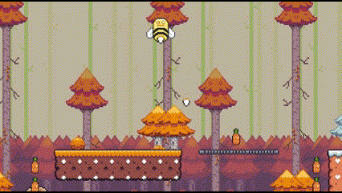
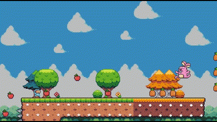
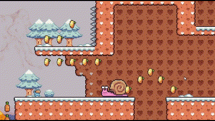

# Virtual-Fruits-Portable

Virtual Fruits portable is the mobile version of the game [Virtual Fruits](https://github.com/OscarLM32/Virtual-Fruits).
In order to adjust the game to the new device and market the genre of the game has been switch from a "platformer" game to 
"finite runner". 

In this version, the players must face a single long level with different enemies,
hazards and items in order to get the best score to position themselves on top of the ladder.

---

## Implementation summary

| **Implemented**                     | **Not implemented**                      |
|-------------------------------------|------------------------------------------|
| Basic character movement &check;    | Autumn enemies and hazards &cross;       |
| All four zones &check;              | Winter enemies and hazards &cross;       |
| All different zones' items &check;  | Summer enemies and hazards &cross;       |
| Spring zone enemies &check;         | Worldwide-connected score ladder &cross; |
| Score system &check;                |                                          |
| Combat &check;                      |                                          |
| Spring environmental hazard &check; |                                          |

---

## Progress showcase

#### Character
|                 Character movement                 |           Character velocity            |
|:--------------------------------------------------:|:---------------------------------------:|
|  |  |

#### Enemies
|           Bee           |               Bunny                |
|:-----------------------:|:----------------------------------:|
|      |             |
|        **Snail**        |        **Plant and combat**        |
|  |  |

### Work in progress
* UI improvement 
* User input improvement
* Character movement adjustment
* Spring enemies adjustment
